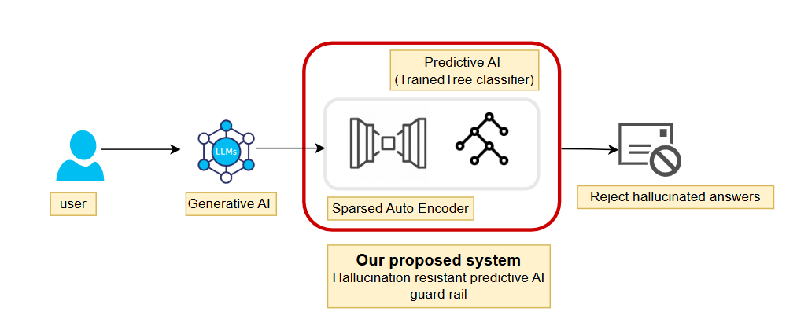
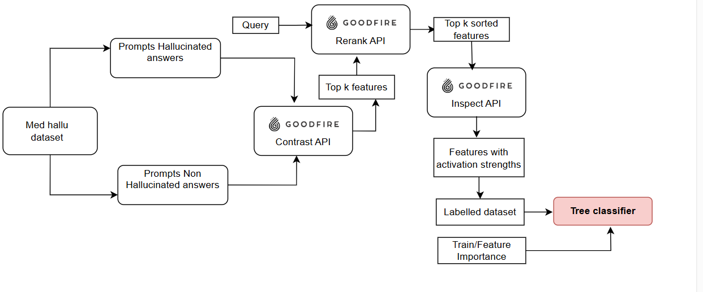

<h1>HalluShield: A Mechanistic Approach to
Hallucination Resistant Models</h1>

Our project tackles the critical problem of hallucinations in large language models (LLMs) used in
healthcare settings, where inaccurate information can have serious consequences. We developed a
proof-of-concept system that classifies LLM-generated responses as either factual or hallucinated.
Our approach leverages sparse autoencoders (GoodFire’s Ember) trained on neural activations
from Meta Llama 3. These autoencoders identify monosemantic features that serve as strong
indicators of hallucination patterns. By feeding these extracted features into tree-based
classification models (XGBoost), we achieved an impressive F1 score of 89% on our test dataset.
This machine learning approach offers several advantages over traditional methods and LLM as a
judge. First, it can be specifically trained on in-domain datasets (eg: medical) for domain-specific
hallucination detection. Second, the model is interpretable, showing which activation patterns
correlate with hallucinations and acts as a post-processing layer applied to LLM output.

Implementation for making labeled dataset for training classifier
1. Dataset Preparation: We split the Med-Hallu dataset into: 
● Non-hallucinated: (question, knowledge, ground truth). 
● Hallucinated: (question, knowledge, hallucinated answer).
2. Feature Extraction: Use Contrast API (Ember) to compute distinguishing features between
hallucinated and non-hallucinated responses.
3. Feature Ranking: Select the top K features from the sparse autoencoder and rank them using
Goodfire ReRank based on the below queries: 
● Hallucination query: "medical misinformation and factual errors in healthcare 
answers" 
● Non-hallucination query: "accurate and factual medical information with proper
evidence"
4. Activation Strengths: Pass ranked features to Inspect API to compute activation strengths of
the above-computed features for the dataset.
5. Labeled Dataset: Construct a dataset with activation strengths and hallucination labels for
supervised learning.
6. Model Training: Train classifiers (Decision Tree, Random Forest, XGBoost) and select the best
model-feature combination.

